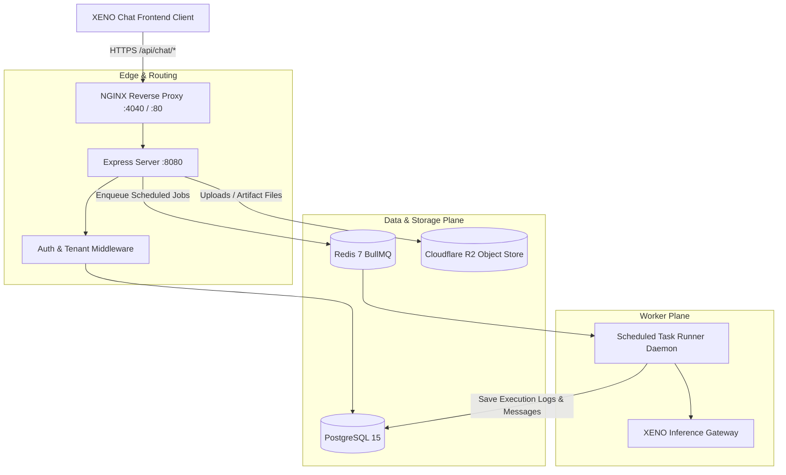

# XENO Chat — Full-Scale Production Platform Specification

**Status**: Draft / Ready for Implementation  
**Author**: XENO Architecture & Platform Core Team  
**Date**: August 24, 2026  
**Target**: `xeno-platform` v2.0  
**Scope**: Full End-to-End Persistence, Automation, Storage, and Public Surfaces for XENO Chat

---

## 1. Executive Summary & Problem Statement

The frontend of the redesigned XENO Chat interface is rich, responsive, and adheres to design system contracts (`@xenosystem/elements-react`, liquid gooey pill controls, dynamic 3-palette theme luminance, token estimators, multi-chat containers). Core chat generation and conversation message persistence to PostgreSQL are live in production.

However, several secondary modules currently rely on client-side in-memory maps or `localStorage`:
1. **Artifacts ([`chatArtifacts.ts`](file:///x:/code/xeno-corporation/.worktrees/xeno-platform-onboarding-gate/src/components/playground/Chat/chatArtifacts.ts))**: Generated code and documents live only in session memory.
2. **Scheduled Tasks ([`chatScheduled.ts`](file:///x:/code/xeno-corporation/.worktrees/xeno-platform-onboarding-gate/src/components/playground/Chat/chatScheduled.ts))**: Automation prompts are kept in client state without a server-side cron runner.
3. **Skills Library ([`chatSkillsLibrary.ts`](file:///x:/code/xeno-corporation/.worktrees/xeno-platform-onboarding-gate/src/components/playground/Chat/chatSkillsLibrary.ts))**: Custom user-created agent skills do not sync to PostgreSQL.
4. **Project Knowledge Files ([`ChatWithLLM.tsx:1634`](file:///x:/code/xeno-corporation/.worktrees/xeno-platform-onboarding-gate/src/components/playground/Chat/ChatWithLLM.tsx#L1634))**: Limited to `localStorage` text strings with no binary/cloud sync.
5. **Shared Chat Viewer ([`App.tsx`](file:///x:/code/xeno-corporation/.worktrees/xeno-platform-onboarding-gate/src/App.tsx))**: Missing a dedicated public `/c/:token` read-only page for anonymous recipients.
6. **Chat Memories & Instructions ([`chatCustomize.ts`](file:///x:/code/xeno-corporation/.worktrees/xeno-platform-onboarding-gate/src/components/playground/Chat/chatCustomize.ts))**: Custom memory facts are not saved in the database.

This specification defines the complete end-to-end architecture, database migrations, API contracts, background worker mechanisms, and frontend integrations to transition every subsystem to full-scale production grade.

---

## 2. Architecture & Sequence Flows



---

## 3. Database Migrations (PostgreSQL)

The following schema extensions build directly on the existing `chat_conversations` and `chat_messages` tables:

```sql
-- ============================================================================
-- 1. CHAT ARTIFACTS
-- ============================================================================
CREATE TABLE IF NOT EXISTS chat_artifacts (
    id UUID PRIMARY KEY DEFAULT gen_random_uuid(),
    user_id UUID NOT NULL REFERENCES users(id) ON DELETE CASCADE,
    conversation_id UUID REFERENCES chat_conversations(id) ON DELETE CASCADE,
    message_id UUID REFERENCES chat_messages(id) ON DELETE SET NULL,
    title VARCHAR(255) NOT NULL,
    kind VARCHAR(50) NOT NULL CHECK (kind IN ('document', 'code', 'image', 'html')),
    language VARCHAR(50),
    content TEXT NOT NULL,
    preview_text TEXT,
    version INTEGER NOT NULL DEFAULT 1,
    is_archived BOOLEAN NOT NULL DEFAULT FALSE,
    created_at TIMESTAMP WITH TIME ZONE DEFAULT NOW(),
    updated_at TIMESTAMP WITH TIME ZONE DEFAULT NOW()
);

CREATE INDEX IF NOT EXISTS idx_chat_artifacts_user ON chat_artifacts(user_id, updated_at DESC);
CREATE INDEX IF NOT EXISTS idx_chat_artifacts_conv ON chat_artifacts(conversation_id);

-- ============================================================================
-- 2. CHAT SCHEDULED AUTOMATION TASKS
-- ============================================================================
CREATE TABLE IF NOT EXISTS chat_scheduled_tasks (
    id UUID PRIMARY KEY DEFAULT gen_random_uuid(),
    user_id UUID NOT NULL REFERENCES users(id) ON DELETE CASCADE,
    conversation_id UUID REFERENCES chat_conversations(id) ON DELETE SET NULL,
    title VARCHAR(255) NOT NULL,
    prompt TEXT NOT NULL,
    model_id VARCHAR(255) NOT NULL DEFAULT 'google/gemini-2.5-flash-preview-05-20',
    cadence VARCHAR(50) NOT NULL CHECK (cadence IN ('once', 'daily', 'weekly', 'monthly')),
    cadence_label VARCHAR(100) NOT NULL,
    status VARCHAR(20) NOT NULL DEFAULT 'active' CHECK (status IN ('active', 'paused')),
    next_run_at TIMESTAMP WITH TIME ZONE NOT NULL,
    last_run_at TIMESTAMP WITH TIME ZONE,
    last_run_status VARCHAR(20),
    last_run_error TEXT,
    created_at TIMESTAMP WITH TIME ZONE DEFAULT NOW(),
    updated_at TIMESTAMP WITH TIME ZONE DEFAULT NOW()
);

CREATE INDEX IF NOT EXISTS idx_chat_scheduled_next ON chat_scheduled_tasks(status, next_run_at);
CREATE INDEX IF NOT EXISTS idx_chat_scheduled_user ON chat_scheduled_tasks(user_id);

-- ============================================================================
-- 3. CHAT CUSTOM AGENT SKILLS
-- ============================================================================
CREATE TABLE IF NOT EXISTS chat_skills (
    id UUID PRIMARY KEY DEFAULT gen_random_uuid(),
    user_id UUID NOT NULL REFERENCES users(id) ON DELETE CASCADE,
    name VARCHAR(100) NOT NULL,
    summary VARCHAR(255) NOT NULL,
    body TEXT NOT NULL,
    author VARCHAR(100) NOT NULL DEFAULT 'You',
    source VARCHAR(50) NOT NULL DEFAULT 'created' CHECK (source IN ('built_in', 'created', 'catalog', 'imported')),
    visibility VARCHAR(20) NOT NULL DEFAULT 'global' CHECK (visibility IN ('global', 'chat')),
    conversation_id UUID REFERENCES chat_conversations(id) ON DELETE CASCADE,
    origin_id UUID REFERENCES chat_skills(id) ON DELETE SET NULL,
    category VARCHAR(50) NOT NULL DEFAULT 'general',
    is_enabled BOOLEAN NOT NULL DEFAULT TRUE,
    created_at TIMESTAMP WITH TIME ZONE DEFAULT NOW(),
    updated_at TIMESTAMP WITH TIME ZONE DEFAULT NOW()
);

CREATE INDEX IF NOT EXISTS idx_chat_skills_user ON chat_skills(user_id);
CREATE INDEX IF NOT EXISTS idx_chat_skills_conv ON chat_skills(conversation_id);

-- ============================================================================
-- 4. CHAT PROJECTS & KNOWLEDGE FILES
-- ============================================================================
CREATE TABLE IF NOT EXISTS chat_projects (
    id UUID PRIMARY KEY DEFAULT gen_random_uuid(),
    user_id UUID NOT NULL REFERENCES users(id) ON DELETE CASCADE,
    name VARCHAR(255) NOT NULL,
    description TEXT,
    custom_instructions TEXT,
    settings JSONB NOT NULL DEFAULT '{}'::jsonb,
    is_archived BOOLEAN NOT NULL DEFAULT FALSE,
    created_at TIMESTAMP WITH TIME ZONE DEFAULT NOW(),
    updated_at TIMESTAMP WITH TIME ZONE DEFAULT NOW()
);

CREATE TABLE IF NOT EXISTS chat_project_files (
    id UUID PRIMARY KEY DEFAULT gen_random_uuid(),
    project_id UUID NOT NULL REFERENCES chat_projects(id) ON DELETE CASCADE,
    user_id UUID NOT NULL REFERENCES users(id) ON DELETE CASCADE,
    name VARCHAR(255) NOT NULL,
    file_type VARCHAR(100) NOT NULL,
    file_size BIGINT NOT NULL,
    storage_key VARCHAR(512),
    content_text TEXT,
    created_at TIMESTAMP WITH TIME ZONE DEFAULT NOW(),
    updated_at TIMESTAMP WITH TIME ZONE DEFAULT NOW()
);

CREATE INDEX IF NOT EXISTS idx_chat_projects_user ON chat_projects(user_id);
CREATE INDEX IF NOT EXISTS idx_chat_project_files_proj ON chat_project_files(project_id);

-- ============================================================================
-- 5. CHAT MEMORIES & PERSONALIZATION
-- ============================================================================
CREATE TABLE IF NOT EXISTS chat_user_memories (
    id UUID PRIMARY KEY DEFAULT gen_random_uuid(),
    user_id UUID NOT NULL REFERENCES users(id) ON DELETE CASCADE,
    content TEXT NOT NULL,
    source_conversation_id UUID REFERENCES chat_conversations(id) ON DELETE SET NULL,
    is_active BOOLEAN NOT NULL DEFAULT TRUE,
    created_at TIMESTAMP WITH TIME ZONE DEFAULT NOW(),
    updated_at TIMESTAMP WITH TIME ZONE DEFAULT NOW()
);

CREATE INDEX IF NOT EXISTS idx_chat_memories_user ON chat_user_memories(user_id);
```

---

## 4. API Endpoints Contract

All endpoints are mounted under `/api/chat/*` and require standard `Authorization: Bearer <xenoos_auth_token>`.

### 4.1 Artifacts API
- `GET /api/chat/artifacts`
  - Query: `kind` (`document` | `code` | `image` | `html` | `all`), `sort` (`updated` | `created` | `name`), `query`
  - Returns: `{ success: true, artifacts: Artifact[] }`
- `GET /api/chat/artifacts/:id`
  - Returns: `{ success: true, artifact: Artifact }`
- `POST /api/chat/artifacts`
  - Body: `{ title, kind, language?, content, preview_text?, conversation_id?, message_id? }`
  - Returns: `{ success: true, artifact: Artifact }`
- `DELETE /api/chat/artifacts/:id`
  - Returns: `{ success: true }`

### 4.2 Scheduled Automation API
- `GET /api/chat/scheduled`
  - Query: `status` (`active` | `paused` | `all`), `sort` (`next` | `updated` | `name`), `query`
  - Returns: `{ success: true, tasks: ScheduledTask[] }`
- `POST /api/chat/scheduled`
  - Body: `{ title, prompt, cadence, cadence_label?, model_id?, conversation_id? }`
  - Computes: `next_run_at` from cadence
  - Returns: `{ success: true, task: ScheduledTask }`
- `PUT /api/chat/scheduled/:id`
  - Body: `{ title?, prompt?, cadence?, cadence_label?, status?, model_id? }`
  - Returns: `{ success: true, task: ScheduledTask }`
- `DELETE /api/chat/scheduled/:id`
  - Returns: `{ success: true }`
- `POST /api/chat/scheduled/:id/run`
  - Manually triggers an immediate execution of the task.
  - Returns: `{ success: true, result: { conversation_id, message_id } }`

### 4.3 Skills Library API
- `GET /api/chat/skills`
  - Query: `visibility` (`global` | `chat`), `conversation_id`
  - Returns: `{ success: true, skills: Skill[] }`
- `POST /api/chat/skills`
  - Body: `{ name, summary, body, category?, visibility?, conversation_id? }`
  - Returns: `{ success: true, skill: Skill }`
- `PUT /api/chat/skills/:id`
  - Body: `{ name?, summary?, body?, is_enabled? }`
  - Returns: `{ success: true, skill: Skill }`
- `DELETE /api/chat/skills/:id`
  - Returns: `{ success: true }`

### 4.4 Projects & Knowledge Files API
- `GET /api/chat/projects`
  - Returns: `{ success: true, projects: Project[] }`
- `POST /api/chat/projects`
  - Body: `{ name, description?, custom_instructions?, settings? }`
  - Returns: `{ success: true, project: Project }`
- `PUT /api/chat/projects/:id`
  - Body: `{ name?, description?, custom_instructions?, settings?, is_archived? }`
  - Returns: `{ success: true, project: Project }`
- `DELETE /api/chat/projects/:id`
  - Returns: `{ success: true }`
- `GET /api/chat/projects/:id/files`
  - Returns: `{ success: true, files: ProjectFile[] }`
- `POST /api/chat/projects/:id/files`
  - Multipart / JSON: `{ name, file_type, content_text, file_size }`
  - Returns: `{ success: true, file: ProjectFile }`
- `DELETE /api/chat/projects/:id/files/:fileId`
  - Returns: `{ success: true }`

### 4.5 Public Shared Conversation API & Viewer
- `GET /api/chat/share/:token` (Public, no auth)
  - Returns: `{ success: true, conversation: { id, title, model_id, messages: [...] } }`
- Public Web Route: `/c/:token` & `/share/:token`
  - Renders standalone read-only chat viewer with copy code, view artifacts, and "Continue conversation in XENO" button.

---

## 5. Background Scheduled Automation Worker (Cron Engine)

A background runner daemon (`src/server/workers/chatScheduledWorker.js`) runs periodically (every 60 seconds):

```typescript
export async function processDueScheduledTasks(db: Pool) {
  const now = new Date();
  
  // Select active tasks due for execution with FOR UPDATE SKIP LOCKED
  const { rows: dueTasks } = await db.query(`
    SELECT * FROM chat_scheduled_tasks 
    WHERE status = 'active' AND next_run_at <= $1
    FOR UPDATE SKIP LOCKED
  `, [now]);

  for (const task of dueTasks) {
    try {
      // 1. Create or find target conversation
      let conversationId = task.conversation_id;
      if (!conversationId) {
        const convRes = await db.query(`
          INSERT INTO chat_conversations (user_id, title, model_id)
          VALUES ($1, $2, $3) RETURNING id
        `, [task.user_id, `[Scheduled] ${task.title}`, task.model_id]);
        conversationId = convRes.rows[0].id;
      }

      // 2. Insert user prompt message
      const userMsgRes = await db.query(`
        INSERT INTO chat_messages (conversation_id, user_id, role, content, message_index)
        VALUES ($1, $2, 'user', $3, (SELECT COALESCE(MAX(message_index), -1) + 1 FROM chat_messages WHERE conversation_id = $1))
        RETURNING id, message_index
      `, [conversationId, task.user_id, task.prompt]);

      // 3. Execute inference via XENO gateway
      const aiResponse = await xenoChatCompletion({
        model: task.model_id,
        messages: [{ role: 'user', content: task.prompt }]
      });

      // 4. Save assistant response
      await db.query(`
        INSERT INTO chat_messages (conversation_id, user_id, role, content, model_id, message_index)
        VALUES ($1, $2, 'assistant', $3, $4, $5 + 1)
      `, [conversationId, task.user_id, aiResponse.text, task.model_id, userMsgRes.rows[0].message_index]);

      // 5. Calculate next run time
      const nextRun = computeNextRun(task.cadence, now);

      // 6. Update task status
      await db.query(`
        UPDATE chat_scheduled_tasks 
        SET last_run_at = $1, last_run_status = 'success', next_run_at = $2,
            status = CASE WHEN cadence = 'once' THEN 'paused' ELSE 'active' END
        WHERE id = $3
      `, [now, nextRun, task.id]);

    } catch (error) {
      console.error(`[ScheduledTaskRunner] Failed task ${task.id}:`, error);
      await db.query(`
        UPDATE chat_scheduled_tasks 
        SET last_run_at = $1, last_run_status = 'failed', last_run_error = $2
        WHERE id = $3
      `, [now, error.message, task.id]);
    }
  }
}
```

---

## 6. Security, Tenant Isolation & Compliance

1. **Tenant Isolation**: Every database query joins on `user_id = req.user.id`. Modifying or deleting any artifact, project, file, skill, or task belonging to another user results in an immediate `404 Not Found`.
2. **Quota & Credit Protection**: Scheduled tasks check the user's available credits before firing; if credits are insufficient, the task is flagged `paused` with error `INSUFFICIENT_CREDITS`.
3. **Sanitization**: Uploaded project knowledge text files are stripped of control characters and normalized before prompt injection.
4. **EU Compliance**: Deleted conversations, artifacts, and projects perform hard cascade deletions across all dependent relational tables.

---

## 7. Implementation Roadmap & Phasing

- **Phase 1 (Artifacts & Public Viewer)**:
  - Database schema migration for `chat_artifacts`.
  - Backend routes in `chatRoutes.js` + client methods in `chatService.ts`.
  - Wire [`chatArtifacts.ts`](file:///x:/code/xeno-corporation/.worktrees/xeno-platform-onboarding-gate/src/components/playground/Chat/chatArtifacts.ts) to API.
  - Implement [`SharedChatView.tsx`](file:///x:/code/xeno-corporation/.worktrees/xeno-platform-onboarding-gate/src/pages/SharedChatView.tsx) and mount `/c/:token` & `/share/:token` in `App.tsx`.
- **Phase 2 (Skills & Customization Persistence)**:
  - Database schema migration for `chat_skills` & `chat_user_memories`.
  - Backend routes in `chatRoutes.js`.
  - Wire [`chatSkillsLibrary.ts`](file:///x:/code/xeno-corporation/.worktrees/xeno-platform-onboarding-gate/src/components/playground/Chat/chatSkillsLibrary.ts) and [`chatCustomize.ts`](file:///x:/code/xeno-corporation/.worktrees/xeno-platform-onboarding-gate/src/components/playground/Chat/chatCustomize.ts).
- **Phase 3 (Projects & Knowledge Storage)**:
  - Database schema migration for `chat_projects` & `chat_project_files`.
  - Backend routes for project management and file uploads.
  - Replace `localStorage` projects state in `ChatWithLLM.tsx` with `chatService` project APIs.
- **Phase 4 (Scheduled Automation Engine)**:
  - Database schema migration for `chat_scheduled_tasks`.
  - Scheduled tasks worker in server background loop.
  - Wire [`chatScheduled.ts`](file:///x:/code/xeno-corporation/.worktrees/xeno-platform-onboarding-gate/src/components/playground/Chat/chatScheduled.ts) to API.
- **Phase 5 (Verification & Automated Test Suite)**:
  - Add end-to-end integration tests for all new routes.
  - Deploy to `xeno-platform-001` and verify live.
