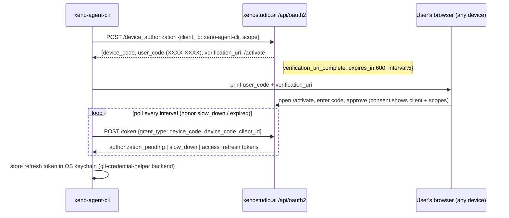

# XENO AUTH — SPEC.md

**Status:** 🔒 LOCKED (v1.0, 2026-07-16). This is the single source of truth for authentication, session, and token handling across the entire XENO ecosystem. It sits beside `XENO MARKETPLACE - SPEC.md` and `XENO AGENTS API - SPEC.md`. Every product (20+ repos) implements this contract. Deviations require a coordinated change here first.

**Canonical copy:** the umbrella root `X:/code/xeno-corporation/XENO AUTH - SPEC.md`. Because every product is its OWN git repo (the umbrella is not a repo), this file is **copied verbatim into each product repo** — the same convention as `release-guide/` — so each repo's agents have it locally even in a standalone clone. Edit the root copy first, then propagate; keep the copies byte-identical.

**Owner of the origin:** `xeno-platform` (xenostudio.ai). **Owner of the broker:** `xeno-hub`. **Owner of the SDK:** a new `@xeno/account` package (canonically maintained in `xeno-post/packages/account-kit`, published for all consumers).

---

## 0. TL;DR + LOCKED decisions

XENO already runs a competent, production-live OIDC provider at `xenostudio.ai/api/oauth2/*` (authorization_code + PKCE-S256, rotating refresh with reuse-detection, RFC 8628 device grant, revoke, introspect, backchannel logout). It was built for the **web relying-party** pattern (xeno-post) and lacks the primitives a desktop **broker** needs. This spec reuses the provider **verbatim**, ships **one** client SDK, and invents only two things: **(a)** a hardened Hub loopback-IPC broker, and **(b)** the per-product-refresh-token convention in the OS keystore. It explicitly **rejects** the tempting shortcut of a shared multi-reader refresh token, because on THIS provider that shortcut is a recurring self-inflicted logout storm (§10, §12).

### LOCKED decisions

- **L1 — One origin.** `xenostudio.ai/api/oauth2/*` is the SOLE account origin. No product re-implements login, password, social, or token minting. (`oauth2Routes.js`, `oidcProvider.js`.)
- **L2 — One SDK.** Every product imports `@xeno/account`. It unifies today's `@xeno/account-client` (OIDC/ledger/authz) + `shared/xeno-account.ts` (billing/entitlements) behind one facade, ships a **browser-safe** build (Web Crypto PKCE, not `node:crypto`), and carries the correct default base `/api/oauth2/*`. The vendored `shared/xeno-account.ts` copies (platform, Pixel, Hub) are retired; platform `authService`/`AuthContext` are demoted to the origin's own login UI.
- **L3 — Every product is an OIDC PUBLIC client, PKCE-S256 only.** Per-product `client_id`. `client_secret` is formally declared **decorative / public** (the provider never verifies it — exchange/refresh/device check only `client_id` equality). No confidential clients in v1.
- **L4 — Flow per surface.** GUI/Electron → RFC 8252 loopback (`http://127.0.0.1:<ephemeral>/callback`, PKCE-S256, public client). CLI/headless/SSH → RFC 8628 device grant. Web → OIDC public client, access token **in memory only**, refresh via **httpOnly, Secure, SameSite=Strict** first-party cookie. Mobile → loopback/redirect PKCE + platform keystore.
- **L5 — Hub is the PREFERRED broker, NEVER a hard dependency.** Model: JetBrains Toolbox + Microsoft MSAL/WAM (broker holds the master credential, apps get scoped per-app tokens). **Anti-model: Adobe Creative Cloud** (broker-as-hard-dependency). Every product MUST still authenticate with Hub uninstalled.
- **L6 — NO shared multi-reader refresh token.** The draft "shared machine session" / `xeno-desktop-sso` full-scope rotating refresh token readable by every same-user app is **KILLED**. Rationale is a hard provider fact: `oidcProvider.js:230-233` revokes the **entire `family_id`** the instant a rotated token is replayed, with **zero grace window**. Two concurrent apps refreshing one shared token → reuse-detection → **logout-everywhere**, recurring ~every 10 minutes. A rotating refresh token may have **exactly one serialized writer**. Silent cross-app SSO comes from the **broker**, not a shared token. Standalone apps hold their **own per-product** refresh token.
- **L7 — The broker ships WITH least-privilege from day one.** When present, the broker is the **sole** holder of any long-lived credential and hands children **short-lived, per-child, audience/scope-down-scoped ACCESS tokens** via RFC 8693 token-exchange. We do **not** ship a "v1 full-scope pass-through" that coexists with a shared refresh token — that combination adds attack surface while leaving the strictly-worse artifact in the keystore. (Security finding: "never run the broker alongside a shared unscoped RT.")
- **L8 — System browser for interactive sign-in.** Never an embedded webview (RFC 8252 §8.12: embedded views are phishable, break SSO, and are provider-blocked). The origin's own `/api/oauth2/authorize` page renders the login UI.
- **L9 — Refresh tokens live ONLY in the OS secure keystore.** Electron `safeStorage` (desktop), OS keychain via the git-credential-helper pattern (CLI), platform keystore (mobile), httpOnly cookie (web). **Hard-fail** Linux `basic_text` and `isEncryptionAvailable()===false` → session-only. **Never** `keytar` (archived 2022-12-15). **Never** `localStorage` for a refresh token. `~/.xeno/*` holds **NO secrets** — metadata only (retire `credentials.json` as a secret store).
- **L10 — The real gate is server-side.** `api.xenostudio.ai` (box `xeno-private-api-001`, PM2 `xeno-api-proxy`) validates the Bearer access token and enforces the v2 credit ledger. This is the only unbreakable paid gate. All client machinery (broker, keystore, entitlement gates, watermarks) is **legitimacy + friction**. **Same-user local malware is explicitly OUT of the client threat model** (it can read any keystore) and is contained by short token TTLs, sender-constraint, and server enforcement.
- **L11 — Sender-constrain tokens (DPoP / RFC 9449).** Bearer tokens are replayable from any machine once exfiltrated. Refresh tokens (and ideally access tokens) are issued DPoP-bound with hardware-backed, non-exportable keys (TPM / Secure Enclave / StrongBox) per surface, enforced at `api.xenostudio.ai`. This is the **only** mechanism that turns "refresh token stolen from keystore" from account-takeover into a non-event. LOCKED as the v2 hard requirement; v1 ships with short TTLs + server enforcement as the interim.
- **L12 — Step-up re-auth for money/account.** Irreversible/sensitive operations (Marketplace payout/cash-out, payout-account change, plan cancel, account delete, logout-everywhere) require a **fresh interactive** auth (`max_age=0` / `acr=mfa`) even when a valid silent session exists. The broker/keystore MUST NOT satisfy step-up silently.
- **L13 — Provider prerequisites are HARD, not parallel.** The provider fixes in §14 (loopback port-flex redirect matching, id_token nonce echo, discovery ES256, scope down-scoping, minimal admin register-client, RFC 8693 token-exchange, api-proxy dual-accept) ship and are verified on `xeno-platform` **before** any product migrates.

---

## 1. Principles

1. **One origin, one identity.** There is exactly one place a XENO user's password/social login is verified: the origin's `/api/oauth2/authorize` page (which reuses the existing `authService` login UI). Everything else consumes tokens. This kills the current three-sign-in-stories fragmentation (`@xeno/account-client` → `/api/oauth2/*`, `shared/xeno-account.ts` → `/api/billing/*`, `authService`/`AuthContext` → legacy `/api/auth/*`).
2. **Hub is the preferred broker, never a dependency.** A Hub-launched app gets zero-friction SSO. A standalone app authenticates itself. Hub disappearing mid-session costs **at most one interactive re-login**, never a broken app. We copy JetBrains Toolbox (auto-login-from-Toolbox, but always a standalone login) and MSAL/WAM (broker holds the master credential, mints per-app tokens). We explicitly avoid Adobe CC's failure mode where member apps degrade when the licensing service is unhealthy.
3. **Client auth is legitimacy + friction; the REAL gate is server-side metering.** The only unbreakable enforcement is `api.xenostudio.ai` validating the Bearer token and debiting the v2 ledger per request. Client-side entitlement gates, watermarks, and feature locks raise friction and improve UX, but are not security boundaries. This is why we can accept that a determined same-user attacker can read a keystore: the token is short-lived, sender-constrained, and buys nothing the server won't independently re-check.
4. **Least privilege, always.** A drawing app (Pixel) must not carry a token that can hit Marketplace payout routes. Per-child audience/scope down-scoping is mandatory the moment the broker hands a token to anything but Hub.
5. **Honest threat model.** We do not market the broker or keystore as containing same-user malware — process-memory injection (ptrace, `ReadProcessMemory`, hardware-breakpoint key-lifting) defeats any local secret store. We state the boundary plainly (§12) and invest defense where it pays: short TTLs, sender-constraint, server enforcement, step-up.

---

## 2. Roles & terminology

| Term | Definition |
|---|---|
| **Origin** | `xenostudio.ai`, the OIDC Authorization Server + OpenID Provider. Endpoints under `/api/oauth2/*` (`oauth2Routes.js`, `oidcProvider.js`). Also hosts the login UI and userinfo (`/api/v2/me`). |
| **Resource server / gate** | `api.xenostudio.ai` (`xeno-private-api-001`, PM2 `xeno-api-proxy`). OpenAI-compatible inference gateway + credit meter. Validates access tokens (`aud='xeno-api'`) and enforces the v2 ledger. Out of THIS repo — verify its exact validation path against its own source. |
| **Broker** | `xeno-hub` main process. Holds ONE interactive login for the machine; mints short-lived, down-scoped access tokens for launched child apps over a local peer-cred IPC channel. Preferred, never required. |
| **Client** | Any XENO product acting as an OIDC public client: Hub, Pixel, Motion, Sound, Canvas, Browser, Web SPA, Agent CLI, mobile, plus existing xeno-post / xeno-api-portal. Each has a `client_id` row in `oauth_clients`. |
| **Session (`sid`)** | An origin-side authenticated session identifier. Present in access-token, id-token, refresh-token, and logout-token claims. `end_session` and reuse-detection operate on `sid` / `family_id`. |
| **Access token** | Short-lived (600s → target 120s) signed JWT, `typ='at+jwt'`, `aud='xeno-api'`, ES256, verify-by-`kid` via JWKS. The Bearer presented to `api.xenostudio.ai`. **Non-revocable today** (dies on TTL) — see §10 for the required denylist. |
| **Refresh token** | Opaque 32-byte b64url, stored sha256-hashed, 30-day, **rotating** with **family-wide reuse-detection** (`issueRefreshToken` / `refreshTokenGrant`, `oidcProvider.js:173-246`). One serialized writer only. |
| **Machine session (broker session)** | The Hub-held origin session that the broker uses to mint child tokens. This REPLACES the rejected "shared refresh token in keystore." |
| **Per-product refresh token** | Each standalone app's OWN refresh token (its own `client_id`, `family_id`, `sid`), in that app's keystore entry. Never shared, never multi-reader. |
| **Device grant** | RFC 8628 flow for headless/CLI/SSH: `/api/oauth2/device_authorization` → user_code → poll `/api/oauth2/token`. |

---

## 3. Token model

### 3.1 Token types & lifetimes (`oidcProvider.js:19-23`)

| Token | Lifetime (current) | Lifetime (LOCKED target) | Format | Rotating? | Revocable? |
|---|---|---|---|---|---|
| Access token | 600s | **120s** (or keep 600s only with a server-side sid/family denylist, §10) | ES256 JWT `typ='at+jwt'` | n/a | Denylist required (§10) |
| ID token | 600s | 600s | ES256 JWT | n/a | n/a |
| Refresh token | 2 592 000s (30d) | 30d + **absolute session max-age** (§9) | Opaque, sha256-hashed at rest | **Yes** (family reuse-detection) | Yes (`/revoke`, `/end_session`) |
| Auth code | 300s | 300s | Opaque | one-time | consumed on exchange |
| Device code | 600s | 600s | Opaque | poll `interval=5s` | consumed on approval |

### 3.2 Access-token claims (`oidcProvider.js:123-127, 240-243`)

```
{ "iss": "https://xenostudio.ai", "iat", "exp",
  "sub": "<user UUID>", "aud": "xeno-api",
  "client_id": "<client_id>", "scope": "openid profile email ledger",
  "sid": "<session id>", "typ": "at+jwt" }
header: { "typ":"at+jwt", "kid":"<key id>", "alg":"ES256" }
```

**Resource-server verify contract (LOCKED):** decode header → fetch key by `kid` from `/api/oauth2/jwks` → verify with the key's actual alg (**ES256**, NOT the discovery-advertised RS256 — see §14 bug) → require `aud==='xeno-api'` → check `exp`/`iat` with ≤60s skew → (v2) verify DPoP `cnf` proof → (§10) check `sid`/`family_id` not on the revocation denylist. **Never** verify by the discovery-advertised alg.

### 3.3 ID-token claims (`oidcProvider.js:128-133`)

`iss, iat, exp, sub, aud=client_id, email, email_verified, name, preferred_username, sid`. **Bug to fix before migration:** the stored `nonce` is NOT echoed into the id_token (`migrate:65` stores it, `mintTokens` drops it) — native replay defense is broken. §14 P-c fixes this; the SDK MUST verify the nonce and reject a missing/mismatched value. ID token is issued on authorization_code + device_code mint only, **not** on refresh.

### 3.4 Scopes catalog

| Scope | Grants | Notes |
|---|---|---|
| `openid` | OIDC subject (`sub`) + id_token | Mandatory for all flows. |
| `profile` | `name`, `preferred_username` in id_token / `/api/v2/me` | |
| `email` | `email`, `email_verified` | |
| `ledger` | Access to `/api/v2/ledger/*` (balance, usage, holds) at the gate | Required by any product that meters compute. |

**Locked additions (§14 provider work):** scopes MUST be **validated against `oauth_clients.allowed_scopes`** at authorize/token time and **down-scoped** — today they are stored+echoed verbatim and never validated (`oidcProvider.js:244`), letting any client request any scope. Introduce fine-grained resource scopes for least-privilege token-exchange (v2): e.g. `inference:run`, `ledger:read`, `ledger:spend`, `billing:manage`, `marketplace:payout`. A leaked Pixel token must carry `inference:run ledger:read ledger:spend` — never `billing:manage` or `marketplace:payout`.

### 3.5 Client-id scheme & registration

**Per-product public client_ids** (all `is_first_party=true`, all PUBLIC/PKCE):

```
xeno-hub, xeno-pixel, xeno-motion, xeno-sound, xeno-canvas,
xeno-browser, xeno-web, xeno-agent-cli, xeno-mobile-ios, xeno-mobile-android
(joining existing: xeno-post, xeno-api-portal)
```

**No shared `xeno-desktop-sso` client** — the shared-refresh-token vehicle is rejected (L6). The broker mints per-child tokens under each child's own `client_id` via token-exchange.

**Registration.** There is NO dynamic registration (RFC 7591 absent — grep-confirmed). Today clients are hand-INSERTed rows. LOCKED: seed all first-party rows via a **DB migration**, and add a **minimal admin/CLI `register-client` path** (the single biggest onboarding blocker — new desktop apps otherwise need a manual DB write). Schema (`migrate-account-v2.js:47-107, :155`):

```sql
oauth_clients(
  client_id      varchar(128) PRIMARY KEY,
  client_secret  text NULL,              -- DECORATIVE / public (never verified)
  name           text,
  redirect_uris  text[],                 -- exact-match today; +loopback flag (§14)
  allowed_scopes text[] DEFAULT '{openid,profile,email,ledger}',
  surface        varchar(64),            -- source_system for external_identity_links
  is_first_party boolean DEFAULT true,
  backchannel_logout_uri text NULL
)
```

**Public vs confidential (L3):** all first-party clients are formally PUBLIC. The provider checks only `client_id` equality on exchange/refresh/device, so a `client_secret` authenticates nothing. Do not pretend any client is confidential in v1. If a genuinely confidential server RP is needed later, implement real `client_secret_post` verification first.

---

## 4. Token storage

**Principle (L9):** refresh tokens and long-lived credentials live **only** in the OS secure keystore. `~/.xeno/*` holds **no secrets** — only non-secret metadata (last-used surface, account `sub`, access-token `exp` hint, keystore-entry handle). This **retires** the plaintext `~/.xeno/credentials.json` refresh storage used by Hub (`auth.ts:54-58`), Pixel (`main/auth.ts:140`), and the CLI (`config/auth.ts:320-330`).

### 4.1 Per-surface storage

| Surface | Refresh-token store | Access token | Guards |
|---|---|---|---|
| **Electron desktop** (Hub, Pixel, Motion, Sound, Canvas, Browser) | Electron `safeStorage.encryptString` → persist base64 ciphertext (e.g. electron-store). Wraps a content key with the OS master key: DPAPI (Win) / Keychain (mac) / libsecret/kwallet (Linux). | Memory only (600s/120s). | **HARD GUARD at startup:** if `isEncryptionAvailable()===false` OR (Linux) `getSelectedStorageBackend()==='basic_text'` → **refuse to persist** the refresh token; degrade to **session-only** with a visible "no secure keystore — you'll re-login next launch" banner. `basic_text` is Chromium's hardcoded-salt `saltysalt` pseudo-encryption = effectively plaintext. |
| **CLI** (xeno-agent-cli) | OS keychain via git-credential-helper pattern: wincred/DPAPI (Win), osxkeychain (mac), libsecret (Linux). | Memory; short-TTL fallback to `~/.xeno/credentials.json` 0600 **access-token-only** if no keychain. | Never write the refresh token to `credentials.json` under any fallback — treat it session-only (re-run device login). `XENO_API_KEY`/`XENO_REMOTE_TOKEN` env for CI, never written by us. |
| **Web SPA** (xeno-web) | httpOnly, Secure, SameSite=Strict first-party cookie issued at `/api/oauth2` callback (or silent-refresh endpoint). | Memory only — a closure, never a global, never localStorage. | Demote/remove `localStorage['xenoos_auth_token']` (XSS-exfiltratable). Add a **double-submit CSRF token** to the cookie refresh endpoint (SameSite=Strict is defense-in-depth, not sole defense). |
| **Mobile** (future) | iOS Keychain (`kSecAttrAccessibleAfterFirstUnlockThisDeviceOnly`); Android Keystore-backed EncryptedSharedPreferences / Jetpack Security. | Memory. | Device-only accessibility; relock-aware where supported. |

**Never `keytar`** (archived 2022-12-15; VS Code / Element / Joplin migrated off).

### 4.2 What NEVER touches disk (unencrypted) / logs / argv / env

- Refresh tokens — all surfaces, keystore only.
- Web access tokens — memory only.
- PKCE `code_verifier` — memory only.
- The broker **launch nonce** — delivered over an **inherited pipe/fd**, NOT env (env is same-user readable via `/proc/<pid>/environ`, PEB, `KERN_PROCARGS2`); burned on first read (§6).
- **No secret in argv.** Remove the `--api-key <value>` form (world-visible via `ps`/`/proc/<pid>/cmdline`/WMI, lands in shell history). Accept keys only via `XENO_API_KEY` env, `--api-key-file <path>` (0600), or stdin.
- **Redaction contract (mandatory):** `@xeno/account` and the proxy MUST never serialize token/verifier/`client_secret`/refresh-token fields; scrub `Authorization`/`Cookie` in any request logging; a lint/unit test MUST fail if a token-shaped string reaches a log sink. Disable verbose token logging in release builds.

### 4.3 Shared-store schema (metadata only)

`~/.xeno/credentials.json` is repurposed to a **non-secret** metadata file so Hub/Pixel/CLI stop drifting on field names (today CLI writes `accountToken`, Pixel writes `webToken` in the SAME file — a session created by one is invisible to the other). LOCKED schema:

```jsonc
// ~/.xeno/account.json  (0600, NO secrets)
{
  "version": 2,
  "sub": "<user UUID>",             // whose session the keystore holds
  "surface": "pixel",               // last product to write
  "accessExpiresAt": 1720000000,    // hint only; the token itself is in memory
  "keystoreRef": "xeno:pixel:refresh", // handle into safeStorage/keychain
  "updatedAt": "2026-07-16T..."
}
```

The refresh token itself is under the keystore ref, never here. Retire `oauth_creds.json` (dead mock).

---

## 5. Auth-resolution PRIORITY CHAIN

`getAccessToken({ silent })` walks this chain and returns a valid Bearer (or `null` when `silent`). Numbered; each step is silent unless it says interactive.

```
1. IN-MEMORY ACCESS TOKEN
   Non-expired (≥60s skew margin) token already held for this surface → use it. No network, no UI.

2. EXPLICIT CREDENTIAL OVERRIDE (unattended / agent / CI)
   XENO_API_KEY env, --api-key-file, provisioned xeno-* key, or XENO_REMOTE_TOKEN (remote runs)
   → use as Bearer directly. Bypasses all interactive paths.

3. HUB BROKER  (preferred, if discoverable + live)
   Discover via inherited launch fd/nonce or ~/.xeno/broker.json → verify Hub identity
   (out-of-band, §6) → request a per-child, down-scoped access token over the peer-cred socket.
   Silent, no UI. Child NEVER receives a refresh token.

4. APP'S OWN PER-PRODUCT REFRESH TOKEN  (from a prior standalone login under THIS client_id)
   Read this product's refresh token from its OWN keystore entry
   → POST /api/oauth2/token grant_type=refresh_token (rotating; single writer = this app).
   Silent.  [NOTE: there is NO "shared machine session" step — L6.]

5. INTERACTIVE SIGN-IN
   GUI/Electron → RFC 8252 loopback (127.0.0.1 ephemeral port) authorization_code + PKCE-S256.
   CLI/headless/SSH → RFC 8628 device grant.
   Web → redirect/iframe PKCE or origin httpOnly-cookie session.

6. GIVE UP
   Raise AccountError(INVALID_TOKEN | UNREACHABLE); surface the product's sign-in affordance.
   Never call a paid route unauthenticated (the gate would 401/402 anyway).
```

> **Difference from the draft design:** the draft had a step-4 "shared machine session (silent refresh of the shared token)". That step is **DELETED** — it is the exact path that trips family-wide reuse revocation across concurrent apps (L6, §10, §12). Silent standalone SSO is provided by the broker (step 3). When the broker is absent, an app that has never logged in standalone simply goes interactive (step 5); thereafter it uses its OWN refresh token (step 4).

`silent:true` and interactive are **mutually exclusive** (VS Code `getSession` semantics): a silent call never shows UI and returns `null` at step 5 instead of prompting. Background/agent contexts always call silent.

---

## 6. Hub broker contract

The broker is `xeno-hub`'s main process exposing a **local peer-cred IPC** surface. It is the sole holder of any long-lived credential on the machine and mints **per-child, down-scoped, short-lived** access tokens.

### 6.1 Discovery

- **Launch-injected (preferred):** at the spawn site (`apps.ts:1212-1224`), Hub passes a **one-time launch nonce over an inherited pipe/fd** (NOT env — L9/§4.2) plus `XENO_BROKER=<transport-hint>`. The nonce is single-use, 5–10s TTL, bound to `{client_id, child PID, child process-start-time}`.
- **Non-launched apps:** read `~/.xeno/broker.json` (0600) `{ version, transport, endpoint, pid, startedAt }` for transport/pid hints ONLY. **`broker.json` is NOT a trust root** (a same-user process can rewrite it) — see 6.3.

### 6.2 Transport

- **Preferred:** unix domain socket (`SO_PEERCRED` uid+pid check) / Windows named pipe (`GetNamedPipeClientProcessId`). **Random per-launch socket/pipe path** recorded in the 0600 descriptor (no well-known path to squat when Hub exits).
- **TCP loopback fallback:** `127.0.0.1` (never `localhost`), OS-assigned ephemeral port. **DIAGNOSTICS ONLY (`/v1/broker/status`)** — it CANNOT do peer-cred so it MUST NOT mint tokens or redeem nonces. If enabled at all: reject any request whose `Host` ≠ `127.0.0.1[:port]` or whose `Origin`/`Sec-Fetch-Site` indicates a browser (anti DNS-rebinding), require a non-safelisted custom header to force a CORS preflight, emit no permissive CORS, require a bearer secret readable only from the 0600 descriptor.

### 6.3 Handshake & trust (the confused-deputy defense)

1. **Broker authenticity is anchored OUT-OF-BAND.** Pin Hub's release **signing/public key in the SDK build**. A child trusts a broker only if: the socket-owning PID resolves to a **code-signed XENO Hub binary** (Win: `GetNamedPipeServerProcessId` → `QueryFullProcessImageName` → Authenticode; mac: peer audit token → `SecCodeCheckValidity` against XENO's requirement; Linux: `/proc/<pid>/exe` → signature/path) AND the broker signs a challenge with the **SDK-pinned key** (NOT the key in `broker.json`). `broker.json`'s self-asserted `brokerPublicKey` is never a trust root.
2. **Child identity is VERIFIED, never self-asserted.** The broker derives the child's `client_id`/audience from the peer's **verified code-signed executable** (peer PID → exe → signature/publisher), NOT from a `client_id` string the caller sends. Peer-cred proves "same user," not "which app"; `client_id` is public and spoofable.
3. **Launch nonce** is defense-in-depth, not a secret: redeemed only over the peer-cred transport, single-use, bound to PID + process-start-time (defeats Windows PID recycling within the TTL).
4. **Non-launched apps require Hub-side CONSENT** (VS Code "Manage Trusted Extensions" model): a revocable per-app grant bound to the **verified signed executable identity** (path+signer), displaying that verified publisher — never the claimed `client_id`. If peer identity can't be verified (TCP), consent is not offered.
5. **Every broker-returned access token is verified by the child against the real issuer JWKS** (`kid`/ES256, `aud='xeno-api'`) before use.

### 6.4 Endpoints (`/v1`, peer-cred transport)

| Endpoint | Purpose | Guard |
|---|---|---|
| `hello` | Capability + protocol-version negotiation; returns `{ version, supportsTokenExchange }`. | none (no secret leaked) |
| `session` | Returns a **short-lived, per-child, down-scoped** access token minted via token-exchange from Hub's session. | launch nonce (PID+start-time bound) OR consent; verified peer signature |
| `refresh` | Broker re-mints the child's access token from Hub's session; **child never sees a refresh token**. | live session bound to the caller |
| `logout` | Drops **only the caller's** broker session. | caller-scoped ONLY |
| `status` | Liveness/version (also the TCP diagnostics surface). | — |

**`logout` is caller-scoped, NOT global** (security finding: a child-invocable global `end_session` is a trivial confused-deputy DoS). Logout-everywhere is a **Hub-UI action** (§10).

### 6.5 Token minting: v1 vs v2

Because we ship the broker **with least-privilege from day one (L7)**:

- **v2 (LOCKED target, ship the broker on this):** RFC 8693 token-exchange. `POST /api/oauth2/token grant_type=urn:ietf:params:oauth:grant-type:token-exchange`, `subject_token`=Hub's session, `audience`/`resource`=child, `scope`=down-scoped child scopes → per-child, audience-scoped, down-scoped access token. Hub's refresh token never leaves the broker.
- **Interim (only if token-exchange isn't yet live):** broker mints a child token carrying an `azp`/`act` claim identifying the **verified** child, and the gate enforces **per-app scope + a per-app spend sub-ledger** server-side. **We do NOT ship a shared full-scope pass-through** — the broker without least-privilege is worse than no broker.

### 6.6 Protocol versioning & start/stop

- Versioned via `broker.json.version` + `/v1` path + `hello` caps. A child ignores an incompatible/older broker and falls through the chain.
- On Hub exit: `broker.json` deleted, socket closed. A child holding a 600s/120s token keeps running; its next `refresh` fails the `hello`-ping → falls to step 4 (own refresh token) → step 5 (interactive) only if it has never logged in standalone. **Worst case = one interactive re-login.** Hub death never breaks a running app.

### 6.7 Sequence — Hub-launched zero-friction SSO

```mermaid
sequenceDiagram
    participant U as User
    participant Hub as Hub (broker)
    participant Child as Child app (e.g. Pixel)
    participant Origin as xenostudio.ai /api/oauth2
    participant Gate as api.xenostudio.ai

    U->>Hub: click "Open Pixel"
    Hub->>Child: spawn(exe); inherited-fd nonce + XENO_BROKER
    Note over Child: SDK.getAccessToken() → chain step 3
    Child->>Hub: connect(unix socket / named pipe)
    Hub->>Hub: verify peer = code-signed XENO Pixel (PID→exe→sig)
    Child->>Hub: /v1/broker/session {launchNonce}
    Hub->>Hub: verify nonce (PID+start-time), burn it
    Hub->>Origin: token-exchange (subject=Hub session, aud=xeno-pixel, scope=down-scoped)
    Origin-->>Hub: per-child access token (120-600s)
    Hub-->>Child: access token (NO refresh token)
    Child->>Child: verify token by kid/JWKS, aud=xeno-api
    Child->>Gate: API call  Authorization: Bearer <token>
    Gate-->>Child: 200 (ledger enforced)
    Note over Child: on expiry → /v1/broker/refresh (no UI)
```

---

## 7. Standalone flows (Hub absent)

### 7.1 Decision: system browser, NOT embedded webview

GUI/Electron interactive sign-in opens the **system browser** to `/api/oauth2/authorize` with a loopback redirect (RFC 8252). **Rationale (L8):** embedded webviews (RFC 8252 §8.12) are phishable (the app can read the credentials), break the origin's own SSO/cookies, defeat password managers and platform SSO, and are increasingly provider-blocked. The origin renders its own trusted login page.

### 7.2 Cold interactive (no session yet)

```mermaid
sequenceDiagram
    participant Child as Standalone app
    participant Loop as 127.0.0.1:<ephemeral> listener
    participant Br as System browser
    participant Origin as xenostudio.ai /api/oauth2

    Child->>Child: build PKCE (S256) + state; start one-shot loopback listener
    Child->>Br: openExternal(/authorize?client_id=<product>
    Note right of Br: &redirect_uri=http://127.0.0.1:<port>/callback
    Note right of Br: &code_challenge=..&code_challenge_method=S256&state=..&nonce=..&scope=..
    Br->>Origin: GET /authorize  (renders "Sign in with XENO")
    Origin->>Br: user authenticates (password / social)
    Br->>Loop: 302 http://127.0.0.1:<port>/callback?code=..&state=..
    Loop->>Loop: verify state (constant-time, single-use); Host==127.0.0.1; exact path
    Child->>Origin: POST /token {authorization_code, code, code_verifier, client_id, redirect_uri}
    Origin-->>Child: {access_token, refresh_token, id_token, scope}
    Child->>Child: verify id_token nonce; store refresh token in OS keystore (THIS product's entry)
    Note over Child: standalone session established; future launches use chain step 4
```

**Loopback listener hardening (mandatory):** bind `127.0.0.1`/`[::1]` only (never `localhost`); accept exactly one callback then close; require the exact expected path; reject any request carrying a cross-site `Origin` or a `Host` ≠ loopback (anti DNS-rebinding / cross-origin callback injection); constant-time single-use `state`; PKCE-S256 makes a stolen `code` useless without the in-memory verifier.

### 7.3 Silent standalone (session already exists for THIS product)

Chain step 4: read this product's OWN refresh token from its keystore entry → `POST /api/oauth2/token grant_type=refresh_token` (rotating; this app is the single writer) → access token. No UI. (There is no shared-token path — L6.)

---

## 8. CLI / headless — device authorization grant (RFC 8628)

Used by `xeno-agent-cli`, SSH sessions, and any surface without a usable browser. This **replaces** the CLI's current custom `/api/auth/cli/device-code` (Redis-backed, custom `XXXX-XXXX` codes) and the custom `start/poll` loopback flow — both migrate onto the OIDC provider, unifying the two parallel device-grant implementations.



- **Phishing mitigation (L12-adjacent):** when a browser is available on the SAME machine, the CLI prefers loopback PKCE (§7.2) — device grant is for input-constrained/remote-only contexts. The `/activate` consent screen prominently shows the client, requested scopes, and a warning ("approve only if YOU started a XENO CLI on YOUR machine"). Rate-limit `/device_authorization`; keep the code TTL short; omit `verification_uri_complete` for high-scope requests.
- **Device grant does NOT auto-seed any machine-wide session** (the draft's "also seeds shared machine session" is dropped with L6). A device login authenticates only the CLI's own `client_id`.
- **CI / unattended:** `XENO_API_KEY` (or `XENO_REMOTE_TOKEN` for remote runs) used as Bearer directly (chain step 2). Never written to disk by us.

---

## 9. Reauth & step-up

### 9.1 Silent (no reauth) — the normal case

Access-token expiry (120s/600s) → silent refresh via the chain (broker step 3, else own refresh step 4). Rotating refresh replaces the stored token atomically; SDK emits `onAuthChanged`. Never an interactive prompt unless refresh itself fails.

### 9.2 Interactive reauth triggers

| Trigger | Detection | Action |
|---|---|---|
| Refresh expired / revoked / reused | `POST /token` → `invalid_grant` / 400 | Force interactive (step 5). If reuse-detection fired, treat as compromise: wipe local session, alert user (§12). |
| Gate rejects a fresh token AND refresh fails | `api.xenostudio.ai` 401 after a silent refresh | Session invalid → interactive. **But first** correct clock skew from the server `Date` header and retry a silent refresh before concluding invalid (avoids spurious re-login on VM/sleep skew). |
| Backchannel / remote logout | `logout_token` for this `sid`, or `end_session` elsewhere | Wipe keystore entry + memory; drop to signed-out (§10). |
| Required scope missing | e.g. `ledger` needed, token lacks it | Re-authorize with the needed scope. **Plan upgrades are NOT this** (see 9.4). |
| Keystore unavailable/downgraded | Linux `basic_text` / `isEncryptionAvailable()===false` | Refuse to persist refresh; session-only; prompt interactive next launch. |
| Account switch / explicit sign-out | user action | Wipe tokens, clear `onAuthChanged` subscribers, interactive on next protected call. |
| Absolute session max-age reached (§9.3) | SDK-tracked | Force interactive even if silent refresh would work. |

### 9.3 Step-up re-auth (LOCKED, L12)

Sensitive/irreversible server endpoints return:

```
401 WWW-Authenticate: error="insufficient_user_authentication",
    acr_values="mfa", max_age=300
```

The SDK exposes `getAccessToken({ acr, maxAge })`; on this challenge it runs an **interactive** `prompt=login` / step-up flow **even when a valid token exists**. The broker and keystore MUST NOT satisfy step-up silently. Endpoints requiring step-up: Marketplace payout / cash-out, payout-account change, plan cancel, account delete, logout-everywhere, scope escalation. Also enforce an **absolute session max-age** (force fresh interactive auth every N days regardless of silent refresh) so a stolen silent session cannot renew forever.

### 9.4 Plan changes are NOT reauth

Plan/entitlements are **never** authorization-of-record in the access token (§12 finding). The gate reads **live** entitlement/ledger state per request (it already does for credits). On a plan **upgrade**, the SDK forces a **silent** refresh to pick up any scope delta (no interactive prompt; the provider issues upgraded scopes on refresh for first-party clients without re-consent). On a **downgrade**, the client entitlement cache (TTL 30–60s) expires and the live server state takes effect promptly — no stale Pro capabilities.

### 9.5 Mid-session 401 handling (every product, uniform)

```
on 401 from api.xenostudio.ai:
  if WWW-Authenticate=insufficient_user_authentication → step-up (interactive), retry
  else:
    correct skew from server Date header
    attempt ONE silent refresh (chain 3/4)
    if refresh ok → retry original request once
    if refresh invalid_grant → interactive (step 5)
    if network UNREACHABLE → offline-grace: keep last-known entitlements read-only,
                             do NOT sign out; retry with backoff
```

Long metered ops (video gen, agent runs > token TTL): refresh **proactively before dispatch** and re-acquire mid-op; ledger holds carry a **server-side auto-void TTL** so a bearer expiring mid-op cannot leak credits via an unsettled two-phase hold.

---

## 10. Logout & revocation

Three distinct operations:

| Operation | Scope | Mechanism |
|---|---|---|
| **Local sign-out** | This app on this device | Wipe in-memory token + this product's keystore entry; `onAuthChanged(null)`. No server call required. |
| **Session end** | This `sid` | `POST /api/oauth2/end_session {sid}` (Bearer) → revokes all refresh for `sid` + fires backchannel logout (`oauth2Routes.js:244-251`, `emitBackchannelLogout:310-339`). |
| **Logout-EVERYWHERE** | All sessions for the user | Hub-UI-initiated (or explicit user-confirmed) → `end_session` per `sid` + backchannel to every RP with a registered `backchannel_logout_uri`. **Never** child-invocable via the broker. |

### 10.1 Making revocation real and instant (LOCKED)

Today access tokens are **non-revocable** (`introspect` returns `active:true` straight from the JWT; `end_session`/`revoke` only kill refresh tokens). So after logout-everywhere, every running desktop app keeps hitting the gate successfully for up to `TTL + skew` (≤660s), and NAT'd Electron apps (no reachable `backchannel_logout_uri`) only discover logout at their next failed refresh. Required:

1. **Server-side access-token revocation at `api.xenostudio.ai`:** a Redis denylist of revoked `sid`/`family_id`, updated by `end_session`/`revoke`, checked per request — OR drop access TTL to **60–120s** so the window is small. (Pick one in §14 open items; the denylist is preferred for "instant.")
2. **Push logout channel for native clients:** a persistent authenticated WebSocket/SSE per running app (or one held by the broker and fanned out to children) carrying logout events. On receipt: wipe keystore + memory; drop to signed-out.
3. **Ordering:** `end_session` revokes the family **server-side first** (so every subsequent refresh 400s), THEN a local cross-process logout broadcast (broker IPC / OS named event) wipes the broker session + all child sessions atomically. Only after server revocation is confirmed do apps fall through the chain (landing correctly on interactive).
4. **Backchannel `logout_token` validation (mandatory):** verify signature via JWKS/`kid`, `iss`==issuer, `aud`==this `client_id`, presence of the back-channel `events` claim, `sid` matches local session, maintain a `jti` replay cache, and **reject** any `logout_token` carrying a `nonce`. Then wipe, scoped to the matching `sid`.

### 10.2 Reuse-detection must NOT false-trip across concurrent apps (LOCKED — the crux)

The provider revokes the **entire `family_id`** on any replay of a rotated refresh token, with **zero grace** (`oidcProvider.js:230-233`). This is correct RFC 9700 behavior for ONE writer. It becomes a **recurring self-inflicted logout storm** if multiple processes share and independently refresh one token — which is exactly why L6 rejects the shared refresh token. Rules:

- **A rotating refresh token has exactly ONE serialized writer.** For a per-product token, that writer is the one product. For the machine session, that writer is the broker.
- No app except the token's owner ever calls `/token grant_type=refresh_token` for that token.
- If a future need ever forces a broker-less shared session (it should not), it MUST be either (a) a **non-rotating, DPoP-sender-constrained** refresh token scoped to one logical device-session, or (b) guarded by a cross-process OS named mutex with atomic keystore write-back AND a provider-side **rotation grace window** (accept the immediately-prior token within N seconds and return the same successor — the Auth0/Okta pattern). Default: don't. Use the broker.
- **Alert on reuse-detection family revocation** and on new-device/new-surface refresh (backchannel + email) so a theft-induced logout-everywhere is visible and recoverable, and so a legitimate storm (if one ever slips through) is diagnosable.

---

## 11. The canonical client SDK contract

Every product imports `@xeno/account`. One facade, three adapters (web / desktop / CLI) behind the same interface. Ships a **browser-safe** build (Web Crypto PKCE) so web + Electron-renderer can import it directly, retiring the vendored `shared/xeno-account.ts`.

```typescript
// @xeno/account — the ONE SDK every XENO product imports.

export interface XenoClientOptions {
  issuer: string;            // "https://xenostudio.ai"
  apiBase: string;           // "https://api.xenostudio.ai"  (the gate)
  surface: string;           // "pixel" | "hub" | "web" | "agent-cli" | ...
  clientId: string;          // per-product OIDC client_id
  store: TokenStore;         // osKeystore | memory | cookie | server
  broker?: BrokerOptions;    // desktop only: discover + consume Hub broker
  // Correct defaults baked in: OIDC base = /api/oauth2/*  (NOT /oauth2/*);
  // verify access tokens by kid via JWKS (NOT the discovery-advertised RS256);
  // require aud === 'xeno-api'.
}

export interface XenoClient {
  // ---- Session (the workhorse) ----
  /** Walks the priority chain (memory→override→broker→own-refresh→interactive).
   *  silent:true never shows UI and returns null instead of prompting. Mutually
   *  exclusive with interactive (VS Code getSession semantics). Accepts step-up. */
  getAccessToken(opts?: { scopes?: string[]; silent?: boolean;
                          acr?: string; maxAge?: number }): Promise<string | null>;

  isAuthenticated(): boolean;
  currentUser(): Account | null;
  me(): Promise<Account>;                 // GET /api/v2/me (legacy /api/auth/me fallback)

  // ---- Interactive sign-in ----
  signIn(opts?: { scopes?: string[] }): Promise<Account>;   // system browser + loopback PKCE (GUI/web)
  beginSignIn(opts?: { redirectUri?: string; scopes?: string[] })
        : Promise<{ url: string; state: string; pkce: PkcePair }>;
  completeSignIn(a: { code: string; codeVerifier: string; redirectUri?: string })
        : Promise<TokenSet>;
  startDeviceLogin(scopes?: string[]): Promise<DeviceAuthorization>;   // RFC 8628 (CLI/headless)
  awaitDeviceLogin(d: DeviceAuthorization, o?: { signal?: AbortSignal }): Promise<TokenSet>;

  // ---- Refresh & logout ----
  refresh(): Promise<TokenSet>;           // rotating; single-writer; auto-replaces stored token
  signOut(): Promise<void>;               // local wipe only
  signOutEverywhere(): Promise<void>;     // /api/oauth2/end_session + backchannel participation

  // ---- Reactivity ----
  onAuthChanged(cb: (u: Account | null) => void): () => void;  // login/refresh/logout/backchannel

  // ---- Entitlements & billing (folded from shared/xeno-account.ts) ----
  entitlements(): Promise<Entitlements>;  // /api/billing/entitlements (FREE fallback)
  can(feature: 'commercial'|'priority'|'watermarkFree'|'4k'|'privateProjects'): Promise<boolean>;
  getSummary(): Promise<AccountSummary | null>;
  getCredits(): Promise<number>;
  startCheckout(itemId: string): Promise<{ ok: boolean; url?: string; error?: string }>;
  openPortal(): Promise<{ ok: boolean; url?: string; error?: string }>;
  readonly billingUrl: string;

  // ---- Metering & authz (existing v2 ledger) ----
  ledger: {
    getBalance(): Promise<Balance>;                                 // gate spend on availableMicro
    recordUsage(i: UsageEventInput): Promise<UsageResult>;          // idempotent on transactionId
    hold(i: HoldRequestInput): Promise<Hold>;                       // two-phase; server auto-void TTL
    settle(holdId: string, actualMicro: number): Promise<Hold>;
    void(holdId: string): Promise<Hold>;
  };
  authz: { check(q: { subject: string; relation: string; object: string;
                      context?: object }): Promise<{ allowed: boolean; reason: string | null }> };

  // ---- Broker (desktop; used internally by getAccessToken, exposed for diagnostics) ----
  broker?: {
    connect(): Promise<BrokerCaps>;                 // discover + hello + verify Hub signature
    requestSession(o: { launchNonce?: string }): Promise<TokenSet>; // access-token-only
    refreshViaBroker(): Promise<TokenSet>;
  };
}

// TokenStore — pluggable; 4 built-ins.
export interface TokenStore { get(k: string): Promise<string|null>;
                              set(k: string, v: string): Promise<void>;
                              delete(k: string): Promise<void>; }
//   osKeystore  — Electron safeStorage / OS keychain. DEFAULT desktop+CLI.
//                 Hard-fails Linux basic_text & isEncryptionAvailable()===false → memory.
//   memory      — web access token; degraded desktop; agent contexts.
//   cookie      — web refresh via httpOnly SameSite=Strict.
//   server      — Redis+Postgres, for xeno-post-style server RPs.

export interface TokenSet { accessToken: string; tokenType: 'Bearer';
  expiresAt: number | null; refreshToken: string | null; idToken: string | null;
  scope: string[]; sid: string | null; }

export interface Account { id: string; email: string; username: string | null;
  displayName: string | null; avatarUrl: string | null; emailVerified: boolean;
  linkedSurfaces: string[]; }

// AccountError.code ∈ DISABLED | UNREACHABLE | INVALID_TOKEN | INSUFFICIENT_CREDITS
//   | CONFLICT | INVALID_RESPONSE | BAD_REQUEST | NOT_FOUND | RATE_LIMITED | PLATFORM_ERROR
```

**Adapter notes:**
- **Web:** `store: cookie` for refresh + `memory` for access; `signIn()` = redirect PKCE; refresh over the httpOnly-cookie endpoint. Never localStorage for the refresh token.
- **Electron:** SDK runs in **main**; renderer reaches it over IPC (`window.xenoAPI.auth.*`); the token never crosses to the renderer as a raw value (Pixel's existing token-in-main pattern is the model). `store: osKeystore`; `broker` enabled.
- **CLI:** `store: osKeystore` (git-credential-helper); `startDeviceLogin`/`awaitDeviceLogin`; `XENO_API_KEY` override respected in `getAccessToken` step 2.
- **Mobile:** `store` = platform keystore; `signIn()` = ASWebAuthenticationSession / Custom Tabs redirect PKCE.

---

## 12. Security requirements

### 12.1 Folded must-fixes (all LOCKED)

1. **Sender-constrain tokens (L11).** DPoP (RFC 9449) or mTLS, keypair in hardware-backed non-exportable storage per surface (Win CNG/TPM, macOS Secure Enclave, Android StrongBox, iOS Secure Enclave); provider issues `cnf`-bound tokens; gate enforces the proof. The ONLY thing that defeats "refresh token stolen from keystore." v2 hard requirement; v1 interim = short TTL + server enforcement.
2. **No shared full-scope refresh token (L6).** Per-product refresh tokens + broker token-exchange. Never a single unscoped RT every same-user process can read and self-renew.
3. **Broker only ships with least-privilege (L7).** Sole long-lived-credential holder + per-child down-scoped tokens. Never broker + shared unscoped RT simultaneously.
4. **Launch nonce over inherited fd, not env (§4.2, §6.1).** Burn on first read; keep PID + peer-cred + process-start-time binding.
5. **No Electron `safeStorage` for cross-app shared secrets.** It is per-app on macOS (a Hub-encrypted blob is undecryptable by Pixel) and inconsistent on Linux — the "well-known entry any XENO app reads" is a false abstraction. Since L6 removes the shared secret entirely, this is moot; if any shared secret ever survives, use explicit platform primitives (Keychain access group / libsecret schema item / shared DPAPI blob) documented as same-user-readable.
6. **Harden loopback TCP broker fallback (§6.2).** Diagnostics-only; bearer secret from the 0600 descriptor; reject cross-site `Origin` + non-`127.0.0.1` `Host`; no permissive CORS; prefer peer-cred transports for anything that mints.
7. **Anchor broker trust out-of-band (§6.3).** Pin Hub's signing key in the SDK; verify the socket-owning process is the code-signed Hub binary; `broker.json` is a transport hint, never a trust root; random per-launch socket path.
8. **Ban secrets from argv (§4.2).** Env / `--api-key-file` / stdin only. Mandatory redaction layer + a test that fails on token leakage into logs.
9. **Absolute session max-age + step-up (§9.3).** Money/account/security operations require fresh interactive auth; alert on reuse-detection revocation and new-device refresh.
10. **Verified-executable consent, not client_id (§6.3).** Consent binds to the signed exe (path+signer), displayed to the user; `client_id` is public and spoofable.
11. **Make revocation real (§10.1).** Access-token denylist (sid/family) at the gate or ≤120s TTL, plus a push logout channel for native clients.
12. **Provider prerequisites before migration (§14).** id_token nonce echo; loopback matching restricted to `127.0.0.1`/`[::1]` literals; discovery advertises real ES256; scope down-scoping vs `allowed_scopes`; full backchannel `logout_token` validation.

### 12.2 Threat model

| Attacker | Can they get a token? | Mitigation / boundary |
|---|---|---|
| **Same-user local malware** | **Yes — accepted, OUT of client scope.** It can read the keystore, ptrace/inject a running app, read env, lift a 600s token from memory. | Contained, NOT prevented: short access-TTL (120s), **sender-constraint (DPoP) so an exfiltrated token is non-portable**, per-app down-scoping (a Pixel token can't spend on Marketplace), server-side ledger as the real gate, step-up for money/account, alert on new-device refresh. We do **not** claim the broker/keystore stops this. |
| **Patched / malicious XENO-looking client** | Only if the broker or origin is fooled into issuing. | Verified-executable consent (not `client_id`); per-child down-scoped tokens; per-app server-side scope enforcement; every broker token verified against JWKS by the child. |
| **Another same-user process racing the broker** | No token if guards hold. | Peer-cred transport (SO_PEERCRED / named-pipe PID); code-signature verify; nonce over inherited fd, single-use, PID+start-time bound; no token minting over TCP. |
| **Malicious web page (DNS-rebinding / port scan)** | No. | Loopback binds `127.0.0.1`; `Host`/`Origin`/`Sec-Fetch-Site` rejection; forced CORS preflight; PKCE-S256 makes a stolen `code` useless; TCP broker path mints nothing. |
| **Network / MITM** | No. | TLS everywhere; PKCE; rotating refresh + reuse-detection; JWKS `kid`-verify; DPoP (v2). |
| **Thief with an UNLOCKED laptop** | Yes for ordinary silent use (OS session unlocks the keystore). | **Step-up (max_age=0) blocks all money/account/security operations** regardless of the cached session; absolute session max-age; hardware-key usage gated on user presence where supported; web keeps the access token in a closure. |
| **Attacker on ANOTHER machine with a stolen refresh token** | v1: yes for 30 days (bearer). **v2: no.** | DPoP hardware binding (L11) makes the token non-portable; provider detects off-key replay. This is why L11 is a hard v2 requirement, not optional. |
| **Device-grant phisher** | Possibly, via social engineering. | Prefer loopback when a local browser exists; consent screen names client+scopes + warning; rate-limit `/device_authorization`; short code TTL; omit `verification_uri_complete` for high scopes; no auto-seed of any wider session. |
| **Concurrent XENO apps (accidental self-DoS)** | n/a (availability) | L6 single-writer rule + broker-only silent SSO eliminates the family-revocation storm entirely. |

### 12.3 The friction-vs-enforced boundary

- **Friction (client-side, best-effort):** keystore encryption, broker handshake, EntitlementGate, watermark, feature locks, loopback hardening. Raises the cost of local attacks and gives good UX. **Never** treated as the security boundary.
- **Enforced (server-side, unbreakable):** `api.xenostudio.ai` Bearer validation (`aud='xeno-api'`, JWKS `kid`, DPoP proof in v2), v2 credit ledger debit per request, per-app scope, step-up challenges, revocation denylist. This is where real value is gated. A client that lies, patches, or leaks a token still cannot exceed what the server independently authorizes for that short-lived, down-scoped token.

---

## 13. Per-product IMPLEMENTATION CHECKLIST

> Copy-pasteable. Do the **PLATFORM (provider)** block FIRST — the rest are hard-blocked on it (§14, L13).

### PLATFORM — provider prerequisites (ship + verify BEFORE any product migrates)
- [ ] Relax redirect matching: accept `http://127.0.0.1:<any-port>/<fixed-path>` and `http://[::1]:<port>/<fixed-path>` for clients flagged `loopback` (currently exact-match, `oidcProvider.js:106`). Loopback literals ONLY — never arbitrary hosts.
- [ ] Seed all first-party `oauth_clients` rows via migration; add a minimal admin/CLI `register-client` path (no RFC 7591 today).
- [ ] Fix `id_token` to echo the stored `nonce` (`mintTokens`, `oidcProvider.js:128-133`).
- [ ] Fix discovery to advertise **ES256** (or add real RS256 keys); SDK verifies by `kid`/JWKS regardless (`oidcProvider.js:93`).
- [ ] Validate + down-scope requested scope against `oauth_clients.allowed_scopes` (`oidcProvider.js:244`).
- [ ] Add RFC 8693 token-exchange grant for the broker (per-child aud + down-scope).
- [ ] Add fine-grained resource scopes (`inference:run`, `ledger:read`, `ledger:spend`, `billing:manage`, `marketplace:payout`).
- [ ] Add step-up support: `insufficient_user_authentication` 401 + `acr`/`max_age` on sensitive endpoints.
- [ ] Add access-token revocation denylist (sid/family in Redis) OR drop access TTL to ≤120s; add a native push-logout channel.
- [ ] Confirm `api.xenostudio.ai` accepts OIDC ES256 access tokens (`aud='xeno-api'`, JWKS `kid`, DPoP in v2) **and** dual-accepts legacy HS256 during the migration window (verify against `xeno-private-api-001` source — out of this repo).
- [ ] Declare all first-party clients formally PUBLIC (or implement real `client_secret` verification if a confidential RP is ever needed).

### @xeno/account SDK
- [ ] Build the unified facade (§11); browser-safe PKCE (Web Crypto, not `node:crypto`).
- [ ] Fold in billing/entitlements; add `TokenStore` built-ins (osKeystore/memory/cookie/server); `onAuthChanged`; broker sub-client.
- [ ] Correct defaults: OIDC base `/api/oauth2/*`; verify-by-`kid`; `aud==='xeno-api'`.
- [ ] Redaction layer + a test that fails if a token-shaped string reaches a log sink.
- [ ] Publish as the ONE package; deprecate vendored `shared/xeno-account.ts` copies.

### Every product (generic)
- [ ] Register a per-product `client_id` (§3.5).
- [ ] Embed `@xeno/account`; remove bespoke auth code.
- [ ] Implement the priority chain (§5) via `getAccessToken`.
- [ ] Refresh token in OS keystore; hard-fail Linux `basic_text` → session-only.
- [ ] Uniform mid-session 401 handling (§9.5) incl. step-up.
- [ ] Wire `signOut` / `signOutEverywhere` + backchannel `logout_token` validation.
- [ ] No secrets in argv/env/logs; no localStorage refresh token.

### Per-product specifics
- **xeno-hub (broker):** register `xeno-hub`; move OFF legacy `/api/auth` onto OIDC (loopback PKCE or device); persist refresh in `safeStorage` (drop plaintext `credentials.json`); STAND UP the peer-cred broker (socket/pipe, random path, `broker.json` 0600 hints, `/v1 hello/session/refresh/logout/status`, verified-exe consent UI); deliver the launch nonce over an inherited fd at the `apps.ts:1212-1224` spawn (NOT env); implement token-exchange minting; caller-scoped logout only.
- **xeno-pixel (NOT greenfield):** adopt the SDK; keep token-in-main + IPC (correct Electron pattern); move the `xeno://auth/callback` deep-link OAuth onto OIDC authorization_code + PKCE (loopback); add refresh; converge the credential field to the shared metadata schema (it currently writes `webToken` vs the CLI's `accountToken` — the drift that breaks cross-app SSO); consume the broker fd/nonce when Hub-launched; keep `EntitlementGate` but source entitlements via the SDK.
- **xeno-agent-cli (pattern donor):** switch the custom `start/poll` loopback flow to real authorization_code + PKCE (receive `?code`, exchange at `/token`); switch `/api/auth/cli/device-code` onto OIDC `/api/oauth2/device_authorization`; store refresh in OS keychain (git-credential-helper), never plaintext; keep `XENO_API_KEY` + `XENO_REMOTE_TOKEN`; its expiry-aware resolver (`config/auth.ts`) is the reusable core.
- **xeno-web:** become an OIDC public client (`xeno-web`) with PKCE + silent refresh; access token in memory, refresh via httpOnly SameSite=Strict cookie + double-submit CSRF; demote/remove `localStorage['xenoos_auth_token']`; keep the `/authorize` `?returnUrl` hand-back (`AuthContext.tsx:56-62`); migrate legacy HS256 sessions during dual-accept; demote `authService`/`AuthContext` to the origin's login UI only.
- **xeno-motion / xeno-sound / xeno-canvas / xeno-browser:** register `client_id`s; adopt the SDK with `osKeystore`; loopback-PKCE standalone + broker fd/nonce consumption; no bespoke auth code.
- **xeno-post (already OIDC):** align to unified SDK defaults (drop the per-call `/api/oauth2` override once the SDK default is corrected); keep `server` TokenStore.
- **Mobile (future):** register `client_id`s; platform keystore store; ASWebAuthenticationSession / Custom Tabs redirect PKCE + device grant for TV/console.

### Per-product-type variant note
- **Electron:** SDK in main, token never raw-crosses to renderer; `safeStorage`; broker fd/nonce; deep-link scheme stays for OAuth callback but carries `?code` (exchanged), not a bearer.
- **CLI:** device grant + loopback PKCE; OS keychain; env overrides for CI.
- **Web:** memory access + cookie refresh; no keystore; redirect PKCE.
- **Mobile:** platform keystore; system auth-session; no loopback server (use app-scheme redirect).

---

## 14. Rollout plan

### 14.1 v1 (pragmatic — reuse what exists, security-corrected)

- Provider prerequisites landed + verified (the PLATFORM checklist).
- `@xeno/account` shipped; products migrate onto OIDC (`/api/oauth2/*`) off legacy `/api/auth/*`.
- **Standalone auth works everywhere:** loopback PKCE (GUI) + device grant (CLI) + web PKCE. Every product independently authenticatable — this alone satisfies "Hub preferred, never required" even before the broker.
- Hub broker: **ships WITH token-exchange + per-child down-scoping from day one (L7)** — we do NOT ship a shared full-scope pass-through. If token-exchange slips, the interim is `azp`/`act`-claim child tokens + per-app server-side scope; still never a shared RT.
- Per-product refresh tokens in the keystore; no `xeno-desktop-sso`.
- Access TTL dropped to ≤120s and/or revocation denylist; push logout channel.
- Legacy HS256 dual-accept window at the gate; migrate sessions; announce cutover date.

### 14.2 v2 (hardening)

- **DPoP sender-constraint (L11)** with hardware-backed keys per surface — the decisive anti-exfiltration control.
- Full MSAL/WAM-analog broker maturity: PRT-style machine session, verified-exe consent everywhere, step-up wired end-to-end.
- Retire the legacy HS256 path entirely after the dual-accept window.

### 14.3 What ALREADY satisfies the spec vs what must be built

| Repo | Already satisfies | Must build |
|---|---|---|
| **xeno-platform (origin)** | OIDC provider: authorization_code+PKCE-S256, rotating refresh + reuse-detection, RFC 8628 device grant, revoke, introspect, backchannel logout, JWKS, discovery, userinfo (`/api/v2/me`), surface-linking, per-branch alg-pinned validation (`auth.js:30-52`). | Loopback port-flex; register-client; id_token nonce; discovery ES256; scope down-scoping; token-exchange; fine-grained scopes; step-up; access denylist / short TTL; push logout; HS256 dual-accept confirmation. |
| **api.xenostudio.ai** (out-of-repo) | Bearer validation + v2 ledger enforcement (the real gate). | DPoP proof enforcement (v2); revocation denylist check; step-up 401s; OIDC ES256 accept + HS256 dual-accept. (Verify against `xeno-private-api-001` source.) |
| **@xeno/account SDK** | `@xeno/account-client` core (OIDC RP, ledger, authz, Zod wire types); `shared/xeno-account.ts` billing/entitlements. | Merge into one facade; browser-safe PKCE; TokenStore built-ins; `onAuthChanged`; `getAccessToken` chain; broker sub-client; correct `/api/oauth2/*` default; redaction. |
| **xeno-hub** | `xeno://` deep-link handler; app-launch spawn site (`apps.ts:1212-1224`); token-as-Bearer to the gate; account SDK read-only wiring. | OIDC session (off `/api/auth`); `safeStorage`; the entire peer-cred broker + verified-exe consent; fd/nonce injection; token-exchange minting; caller-scoped logout; push-logout fan-out. |
| **xeno-agent-cli** | Most mature multi-flow auth (loopback-poll, custom device-code, token paste, email/pw); expiry-aware file resolver; `XENO_API_KEY`/`XENO_REMOTE_TOKEN`. | Loopback-poll → real PKCE code-exchange; custom device-code → OIDC device grant; keychain storage; canonical field names; no secret in argv. |
| **xeno-web** | localStorage JWT session; social `?token=` handoff; `/authorize` `?returnUrl` hand-back. | OIDC public client + PKCE; memory access + cookie refresh + CSRF; drop localStorage refresh; HS256 migration; demote authService to login UI. |
| **xeno-pixel** | Full standalone auth in main; token-in-main + IPC; system-browser OAuth via `xeno://` + CSRF state; `EntitlementGate`; canonical account client wired. | OIDC PKCE (off `/api/auth`); refresh; converge credential field; broker fd/nonce consumption; entitlements via SDK. |
| **xeno-post** | Already an OIDC client (registered). | Align to SDK defaults; drop per-call `/api/oauth2` override. |
| **motion / sound / canvas / browser / mobile** | (greenfield auth) | Register `client_id`; adopt SDK; loopback-PKCE + broker consumption; keystore. |

---

*End of XENO AUTH — SPEC.md (v1.0, LOCKED). Change this file first; propagate second.*